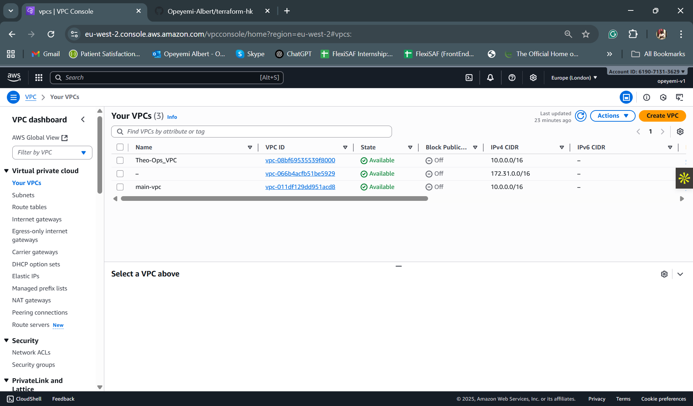
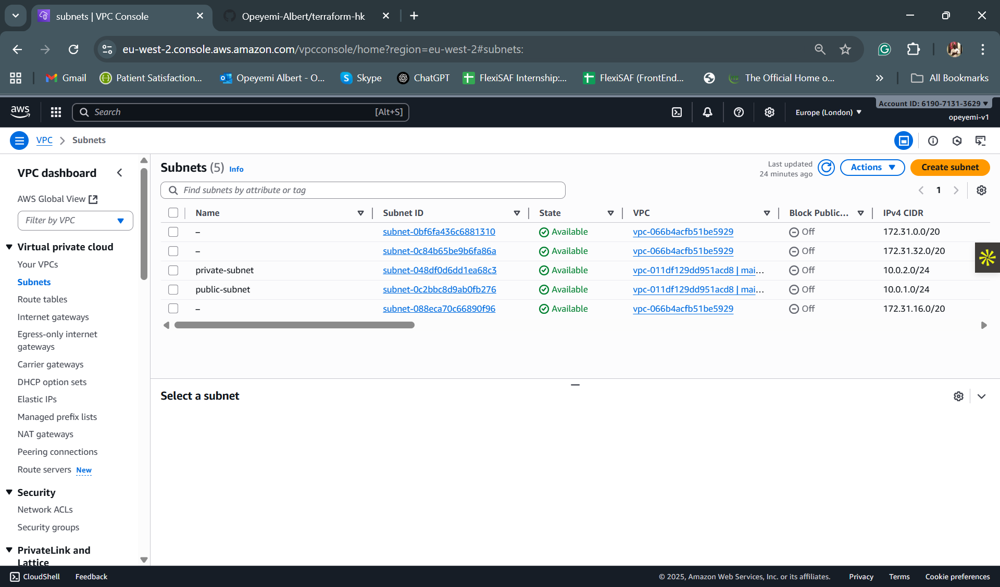
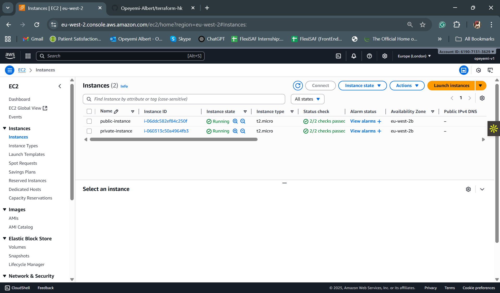

# Terraform AWS Infrastructure Project

## Overview
This project uses **Terraform** to provision AWS infrastructure in a modular, environment-specific way. It demonstrates best practices for managing multiple environments, secure SSH access, and reusable modules.  

The project provisions:  
- A **custom VPC** with public and private subnets  
- Two **t2.micro EC2 instances**:  
  - One in the public subnet (with SSH access)  
  - One in the private subnet  
- A **generated SSH key pair** for secure access to the public instance  
- Remote state management using **S3** and optional **DynamoDB** for locking  
- Separate configurations for **dev, staging, and prod environments**  

---

## Project Structure
project-root/
├── env/                           # Environment-specific configs
│   ├── dev/
│   │   ├── backend.tf             # Backend config for dev state
│   │   └── dev.tfvars             # Input variables for dev
│   ├── staging/
│   │   ├── backend.tf             # Backend config for staging state
│   │   └── staging.tfvars
│   └── prod/
│       ├── backend.tf             # Backend config for prod state
│       └── prod.tfvars
│
├── modules/                       # Reusable modules
│   └── network/
│       ├── vpc.tf
│       ├── subnets.tf
│       ├── instances.tf
│       ├── keypair.tf
│       ├── outputs.tf
│       └── variables.tf
│
├── main.tf                        # Root module wiring everything together
├── vars.tf                        # Shared variables across environments
├── outputs.tf                     # Shared outputs
├── provider.tf                    # AWS provider config
├── Makefile                       # Commands for init, plan, apply, destroy
└── .gitignore                     # Ignores SSH keys, Terraform state files, etc.


---

## Environments
- **dev**, **staging**, and **prod** environments are isolated.  
- Each environment has:  
  - `backend.tf` → Remote state configuration (S3 + DynamoDB)  
  - `<env>.tfvars` → Environment-specific input variables (CIDRs, regions, instance types, SSH keys, etc.)  

---

## Prerequisites
- Terraform >= 1.4.x  
- AWS CLI configured with appropriate profiles (`dev-profile`, `staging-profile`, `prod-profile`)  
- SSH keypair generated for EC2 access (public key referenced in `.tfvars`)  
- Make installed for convenience commands  

---

## Usage
### Initialize Environment
```bash
make init ENV=dev

### Plan Infrastructure
```bash
make plan ENV=dev

### Apply Infrastructure
```bash
make apply ENV=dev

Replace ENV=dev with ENV=staging or ENV=prod to work with other environments.

### Access your public EC2 instance using the private key:
ssh -i terraform-hk/ssh-keys/dove-key ubuntu@<public-ip>

### Destroy Infrastructure
```bash
make destroy ENV=dev

### VPC


### Subnets


### Instances
